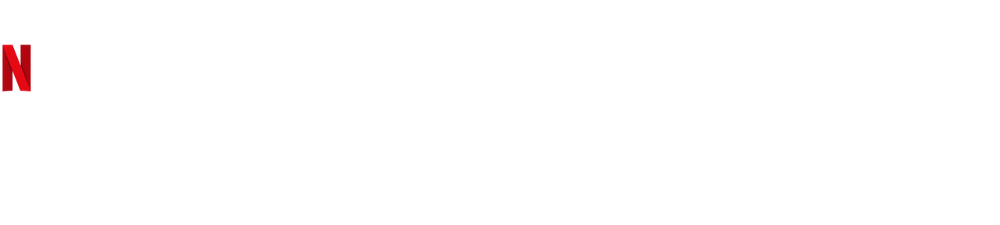

# Dark Characters Network

Netflix's Dark is a German science fiction thriller web television series co-created by Baran bo Odar and Jantje Friese. This series plays with time travel theories and creates a complex network of relationships among its characters. **This repository contains the data and code for a network analysis visualization that tries to make it easier to understand the complex plot**.

**The data was acquired by scraping [Dark's Fandom page](https://dark-netflix.fandom.com/), a colaborative platform for fans.**

## Requirements
**Python**

* beautifulsoup4==4.7.1
* pandas==0.24.2
* tqdm==4.46.0
* requests==2.21.0
* urllib3==1.24.1

**Javascript**
* vis.js==7.8
